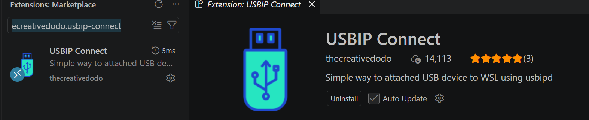
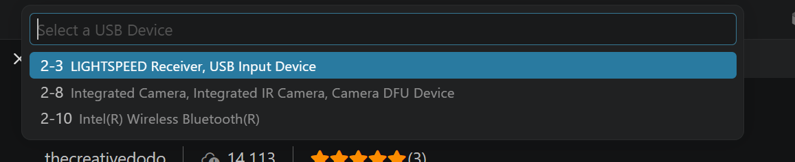

# Forward the FPGA board into WSL

The toolchain is installed and `anvil doctor` is green, but `anvil program` cannot
find the board. That is expected, and it is not a broken install.

WSL2 is a virtual machine. It has no USB ports of its own, so a board plugged into
your laptop is visible to Windows and invisible to Linux. `openFPGALoader` runs
inside WSL, so something has to hand the USB device across. That something is
[usbipd-win](https://learn.microsoft.com/windows/wsl/connect-usb), which
`wsl-setup.ps1` already installed for you.

What is left is the part that cannot be done once and forgotten: **attaching the
board**, after every reboot and every replug.

!!! note "WSL only — the whole page"
    This is a WSL2 problem only. On Ubuntu the board is already a local USB device
    and the udev rule the installer added is all you need.

## Find your board in the list

Every method below starts the same way: you have to know which entry in the list
*is* the board. The reliable way to find out is to look twice.

**First, with the board unplugged**, open a PowerShell and run:

```powershell
usbipd list
```

You will see your mouse receiver, webcam, Bluetooth radio and whatever else is
built into the laptop. Ignore all of it — that is the baseline.

**Now plug the board in, switch it on, and run the same command again.** The new
entry is your board. On the machine these instructions were written on it appeared
as:

```
BUSID  VID:PID    DEVICE                                            STATE
2-4    0403:6010  USB Serial Converter A, USB Serial Converter B    Not shared
```

**Yours may read differently.** The name comes from the USB chip, not the board, so
a different board — or the same board on another machine — can be listed under
another name and another BUSID. Two things are reliable:

- the VID:PID is `0403:6010` (FTDI, the USB chip on the Nexys A7)
- it is the entry that was not there a moment ago

Write down the BUSID. Every method below needs it, and it can change when you use a
different USB port.

!!! warning "Nothing listed?"
    If no new entry appears when you plug the board in, Windows itself cannot see
    it and none of the methods below will help. Check the cable — some USB cables
    carry power only — then the board's power switch, then another port.

Pick **one** of the three methods below. They all do the same thing.

---

## Method 1 — VS Code extension { .step }

The easiest one if you already work in VS Code, because the button sits next to
everything else you use.

!!! warning "Connect VS Code to the toolchain's distro first"
    VS Code keeps two separate sets of extensions — one on Windows, one inside each
    WSL distro — and this one has to live **inside** the distro you installed the
    toolchain into (default name `anvil`). Installed on the Windows side, or into a
    different distro, the button either never appears or hands the board to the
    wrong Linux.

    Open the distro with **WSL: Connect to WSL using Distro…** from the command
    palette, and check the bottom-left corner reads `WSL: <your distro>` before
    going any further.

With that window open, install **USBIP Connect**
(`thecreativedodo.usbip-connect`) from the Extensions marketplace — VS Code then
installs it into the distro rather than onto Windows:



An **Attach** button appears in the status bar at the **bottom** of the window,
next to that same `WSL:` indicator — which is how you can tell at a glance that it
will attach to the right distro:


Click it and a device picker opens at the **top** of the window:



**There is no board in that screenshot** — it was taken with nothing plugged in,
which is why only a mouse receiver, a camera and a Bluetooth radio are listed. With
your board connected and powered on it appears in this same list, and that is the
entry you pick: the one matching the BUSID you noted above.

The extension binds and attaches by itself, so no Administrator PowerShell is
needed.

!!! note "Picking the wrong one is recoverable"
    Attaching your mouse receiver or webcam hands that device to Linux and takes it
    from Windows — briefly confusing, not harmful. Attach it back, or unplug and
    replug it.

## Method 2 — wsl-usb-manager { .step }

A small Windows GUI that does the same job outside VS Code, with a device list you
can leave open: <https://github.com/nickbeth/wsl-usb-manager>

Follow the install and usage instructions in that project's README. It is not ours
and we do not pin a version of it.

## Method 3 — command line { .step }

Worth knowing even if you use a GUI: it is what they call underneath, and it is the
only method that works over SSH or from a script.

There are two steps, and they are not the same kind of step.

**Once per board** — registers the device for sharing. Needs an **Administrator**
PowerShell, and survives reboots:

```powershell
usbipd list                           # find the BUSID of the board
usbipd bind --busid 2-4               # use your BUSID, not this one
```

**Every session** — hands the device to WSL. A normal PowerShell is enough, and
this is the one you repeat after each reboot or replug:

```powershell
usbipd attach --wsl --busid 2-4
```

Confirm it arrived, from inside WSL:

```bash
lsusb                 # look for Future Technology Devices (0403:6010)
ls /dev/ttyUSB*       # serial console device
```

Then `anvil program` behaves exactly as it does on native Linux — the installer
already added the udev rule, so no `sudo`.

### Not having to repeat it

`--auto-attach` re-attaches the device when it is unplugged and plugged back in, at
the cost of leaving that PowerShell window open:

```powershell
usbipd attach --wsl --busid 2-4 --auto-attach
```

### Giving the board back to Windows

```powershell
usbipd detach --busid 2-4             # end this session's attachment
usbipd unbind --busid 2-4             # undo the registration (Administrator)
```

---

## When it does not work

| Symptom | Cause and fix |
|---------|---------------|
| `usbipd list` does not show the board | Windows cannot see it. Cable (some are power-only), power switch, another port. |
| Attach succeeds, `lsusb` shows nothing | Kernel modules missing. Re-run `wsl-setup.ps1` — step 6 checks `vhci-hcd` and `ftdi_sio`. `wsl --shutdown` then start again fixes the common case of WSL still running an older kernel than the one installed. |
| `usbipd bind` says access denied | Not an Administrator PowerShell. `bind` needs one; `attach` does not. |
| The VS Code **Attach** button is missing | The extension went onto Windows instead of into the distro. Check the bottom-left says `WSL: <your distro>`, then install it again from that window — the marketplace entry offers *Install in WSL* when you are connected. |
| Attached, but WSL still cannot see it | You may have more than one distro. `wsl --list` shows them all; the board goes to whichever one attached it. |
| It worked yesterday, not today | The attachment does not survive a reboot. Run `attach` again — expected, not a fault. |
